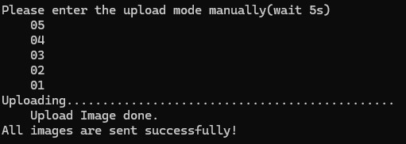
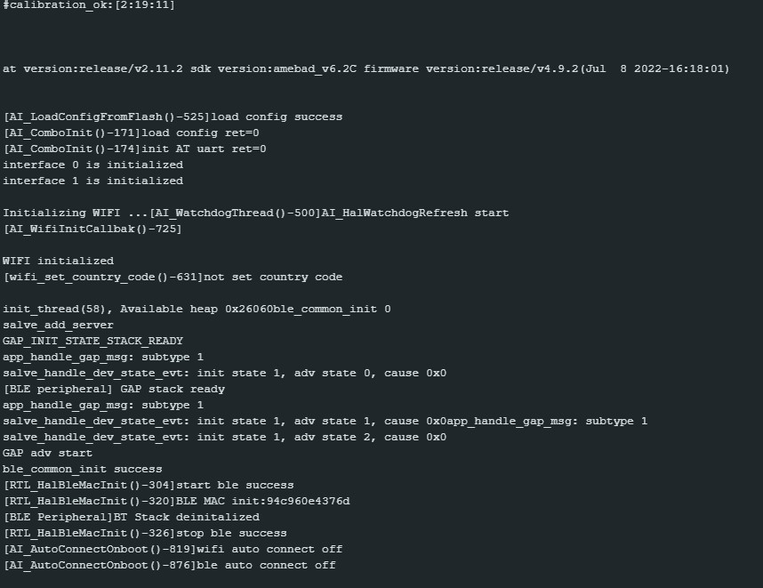
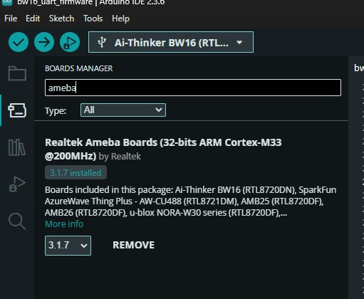
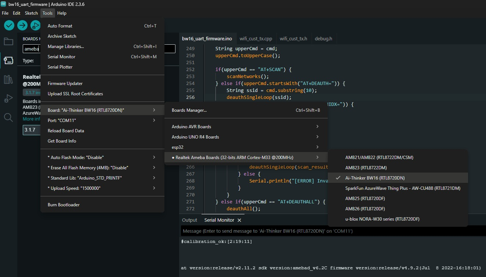
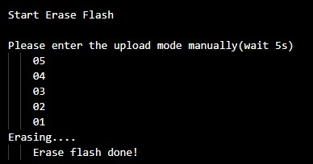
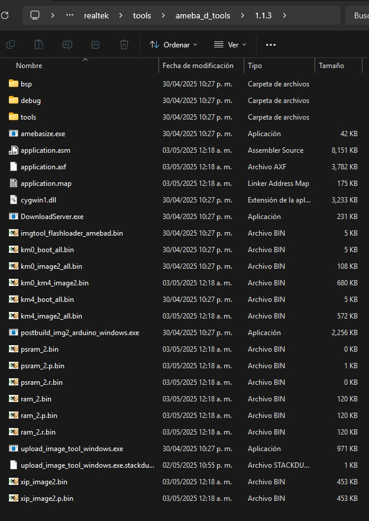
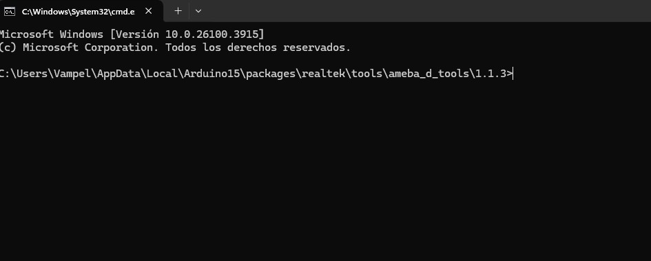
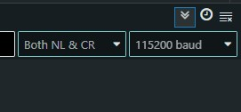
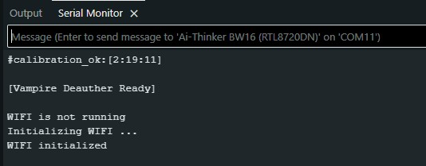
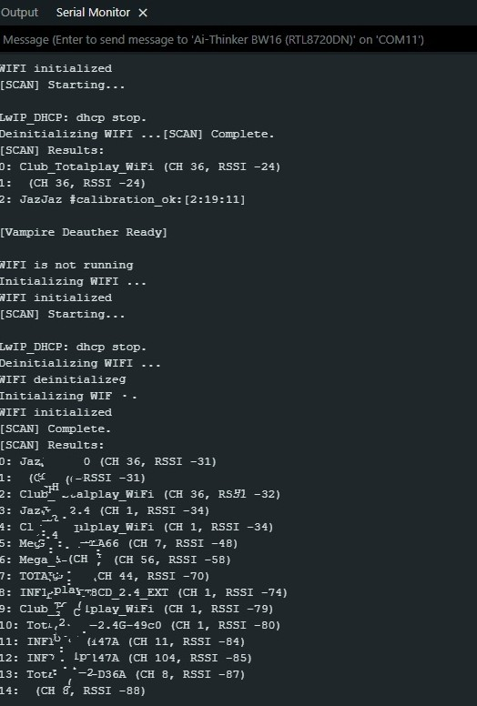

# Vampire-Deauther
Pentesting 2.4ghz 5ghz
# BW16 y Flipper Zero
⚠️ **ADVERTENCIA**: Solo para pruebas éticas en redes propias o autorizadas.  
⚠️ **ADVERTENCIA**: El proyecto es con fines educativo y para pentesting.  
⚠️ **ADVERTENCIA**: Esta en modo beta, apenas haciendo funcionar la aplicacion del flipper zero (con firmware Momentum).  
⚠️ **ADVERTENCIA**: No usar INO usar el .bin

## Proyecto basado en estos repositorios:
https://github.com/tesa-klebeband/RTL8720dn-Deauther (para uso del firmware del BW16)  
https://github.com/dkyazzentwatwa/cypher-5G-deauther (para el uso del firmware del BW16)   
https://github.com/ultramarinez/RTL8720dn-5GHz-Wifi-Deauther/tree/main (para el uso del firmware del BW16)  
 
 ## Firmware Listo.  
 Para cargar el archivo .bin no usar el INO, no es funcional, lo mas dificil de los BW16 es borrar el firmware de fabrica, por mas que cargues el archivo y diga:  
 
 

 Entonces veras que te sigue cargando el firmware de fabrica(Usando Arduino IDE en monitor):  

 

Lo que debes hacer es borrarlo para que no te salga lo de la imagen anterior, para eso debes borrar el firmware primero, a mi me funciona usando Arduino IDE seleccionando la board Ameba  

Despues seleccionar el puerto COMx de tu Board y cambias Erase All Flash Memory (4MB) a "erase only":  

y le das cargar cualquier firmware y veras:  

_En Arduino IDE veras solo # y ya no lo del firmware de fabrica_  

lo que sigue es cargar el firmware: bajas de este repositorio el km0_km4_image2.bin y pegarlo en la ruta del Arduino Ameba:

C:\Users\Name\AppData\Local\Arduino15\packages\realtek\tools\ameba_d_tools\1.1.3 y pegar el bin en esta ruta, deberias ver algo asi:

Sobre esa misma ruta en la barra escribes CMD y presionas Enter, deberia abrir el CMD con la ruta de la carpeta

en CMD escribirias o pegarias esto:  

upload_image_tool_windows.exe "C:\Users\Vampel\AppData\Local\Arduino15\packages\realtek\tools\ameba_d_tools\1.1.3" "COM11" "ameba_rtl8720dn_bw16" "Disable" "Disable" "1500000" (cambiar el puerto COM)  

Cambiar _Vampel_ por tu usuario (mismo nombre que etu CMD muestra)  

Al presionar enter deberias de ver esto:

  

Presionar el boton RESET del BW16 para que se reinicie y deberias ver el LED verde encendido, inidicado que esta listo, firmware cargado!.

## Leds
Verde encendido = BW16 listo  
Azul parpadea = Escaneando redes wifi's  
Rojo parpadea = Deauthing Single  
Rojo parpadea (mas lento) = Deauth a todas las redes  
Verde parpadea = Beacon Spam  

## Usar con Arduino IDE.

Seleccionas Ameba board, BW16(RTL8720DN) y el puerto COM

Abrir monitor y poner en:

## Comandos  
_Usaremos monitor para mandar los comandos hasta que quede el FAP para poder mandar comandos con el Flipper Zero._  

Presiona boton Reset con Arduino IDE abierto en monitor y veras:  

Listo para mandar comandos por Monitor!

AT+SCAN = Scanea redes wifi y las guarda en memoria como index (numeradas)

  

_Para usar Deauth primero ocupas escanear las redes_ 

AT+DEAUTHIDX=5 (o el numero del index del Index) = hace deauth a una sola red (presionar boton reset para reiniciar el BW16)  

AT+DEAUTHIDX=ALL = Deauth a todas las redes del Index (presionar boton reset para reiniciar el BW16)  

AT+BEACONRANDOM=Vampel = Espamea redes con ese suffix "vampel 001, Vampel 002 y sigue" (despues del = puedes poner lo que quieras)

Hay mas opciones en el menu pero por ahorita son las principales.

La idea es que El flipper mande esos comandos por UART(GPIO) como el wifi marauder y reciba los mensajes del BW16 como hasta ahorita se ven por Arduino IDE Monitor.

## Características  
- Deauth 2.4GHz y 5ghz(Por el BW16 que es dual band).  se debe usar el BW16 de 22 pins (negro), el BW16e de 30 pines no funciona (azul)  
  
- Control via Flipper Zero (.fap). (en progreso)

## Uso  
1. Carga el firmware en el BW16.  
2. Abre la app en el Flipper Zero.  
3. Selecciona el modo (deauther / sniff etc.).

## Conexiones
BW16 (22 pines)                Flipper Zero GPIO Header
================              =========================

Pin 1  - 3V3   (Rojo)     --->   Pin 9   - 3.3V (salida) ✅  
Pin 2  - GND   (Negro)    --->   Pin 18  - GND ✅  
  
Pin 3  - PA07_TXD (Amarillo) --> Pin 14  - RX (Flipper recibe datos) ✅ //no se ocupara?  
Pin 4  - PA08_RXD (Blanco)   <-- Pin 13  - TX (Flipper transmite datos) ✅ // no se ocupara?  
  
Estamos usando UART0 (lo mismo que en USB-C
  
  
##Estructura del Menu en Flipper Zero:  
applications_user/  
└── vampire_deauther/  
    ├── vampire_deauther.c    # Punto de entrada principal  
    ├── vampire_deauther.h    # Definiciones principales  
    ├── views/  
    │   ├── view_main.c       # Lógica de la interfaz  
    │   └── view_main.h       # Definiciones de la vista  
    └── application.fam       # Configuración de compilación  
    
  

    
##Estructura del firmware:

/Vampire-Deauther/  
└── BW16-Firmware/  
    ├── bw16_uart_firmware.ino        # Archivo principal  
    ├── debug.h                   # Configuraciones globales  
    ├── wifi_cust_tx.cpp  
    ├── wifi_cust_tx.h  
    
